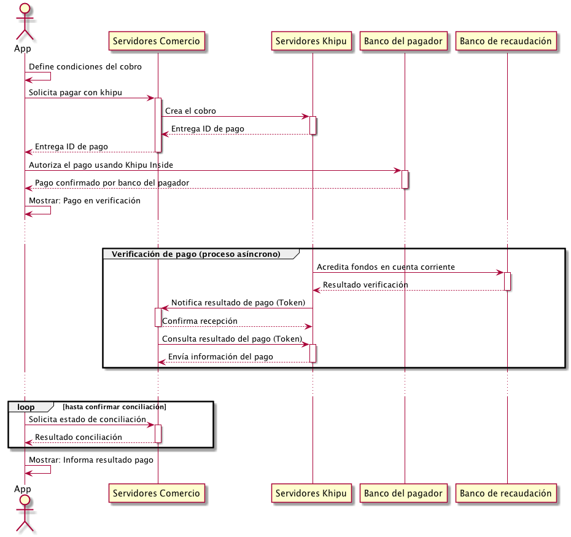

# Khipu Inside

## Introducción

Khipu Chile es un medio de pago que opera en Chile. Permite a comercios cobrar electrónicamente y a clientes pagar con sus cuentas bancarias (Corrientes, Vistas, Chequeras electrónicas, etc.).

El uso estándar de Khipu requiere que el cliente pagador instale una aplicación móvil, el terminal de pagos Khipu.

Khipu Inside permite, a comercios que cuenten con una App (Android y/o iOS), embeber el proceso de autorización del pago directmente en su App, bajando, con esto, la fricción en el proceso de compra y, por lo tanto, aumentando la conversión del proceso completo.

Este repositorio es la documentación y ejemplo de como realizar una integración Khipu Inside. Se cubren los casos de aplicaciones Android e iOS y de servidores con tecnología Java, PHP, Ruby y .NET.

## Esquema general

En khipu encontrarás lo necesario para integrar tu portal web o app sin que tengas que solicitar credenciales o recursos de acceso limitado. Puedes crear o descargar con autonomía todo lo que necesitas. La única excepción a esta regla son las cuentas de integrador. La cuentas de integrador son para desarrolladores de portales que crean comercios en khipu para la recaudación en sus soluciones. Por ejemplo, un mall virtual con muchas tiendas distintas o una solución que cobra los gastos de administraciónes de muchas comunidades en que cada comunidad es un comercio distinto. No se requiere una cuenta de integrador para una integración normal.

## Pre-requisitos normales

1. Tener una cuenta de cobrador en [khipu.com](https://khipu.com). Existen cuentas de cobro regulares y en "modo desarrollador". En ambas el ciclo de creación, autorización y conciliación del pago es idéntico. La diferencia es que en las cuentas regulares se utilizan Bancos y dinero real mientras en las en "modo desarrollador" ficticios. Recomendamos usar una cuenta en "modo desarrollador" en el proceso de desarrollo y pruebas de la integración y en producción cambiar las credenciales de acceso a la API por las de una cuenta regular.
2. Un servidor capaz de conectarse por HTTPS a khipu.com y capaz de disponibilizar un endpoint web para recibir las notificaciones de conciliación de los pagos recibidos.
3. Una aplicación móvil para Android o IOS. En este documento se asumirá que la aplicación es nativa, pero existen plugins y bridges para otras tecnologías como Cordova, React Native, etc.

## Definición del cobro a realizar (en la app del cobrador)

En este punto el cliente define lo que pagará utilizando la app del cobrador. Puede ser un carro de compras, una compra única o cualquier otra modalidad que el cobrador defina. Para los efectos de la integración con Khipu Inside, sólo es relevante que queden definidos el motivo del pago, el monto a pagar y la moneda de éste.

## Creación de la solicitud de pago (en el servidor del cobrador)

Para crear un solicitud de pago se utiliza la "[API de khipu para crear cobros y recibir pagos (v 2.0)](https://khipu.com/page/api)", esta es una API REST y Khipu disponibiliza clientes para esa API en Java, Ruby, PHP y .NET.

En la carpeta "server" de este repositorio se encuentra el código fuente de ejemplo implementado en los diferentes lenguajes.

En la misma carpeta estan los archivos **RECEIVER_ID** y **SECRET**, esos archivos contienen las credenciales de un comercio de pruebas que permite ejecutar los ejemplos. 

En todos los lenguajes el proceso es el mismo, primero se obtienen las credenciales del comercio (RECEIVER_ID y SECRET), luego se utiliza el endpoint [POST /payments](https://khipu.com/page/api-referencia#paymentsPost) para crear una solicitud de pago y finalmente se imprime en la consola el identificador único del pago (paymentId) que se utilizará en la aplicación móvil.

Al momento de crear el pago se definen los parámetros obligatorios:

- Motivo del pago
- Monto
- Moneda
- URL de notificación

Además de parámetros opcionales, como por ejemplo, el correo electrónico del pagador o asociar una imágen al cobro. Puedes ver [los ejemplos de uso avanzado de API](https://khipu.com/page/api-usos-avanzados) para conocer más sobre las oportunidades que plantea.

En este proyecto se encuentran ejemplos de implementaciones en:

- Java (Gradle y Maven) [ver documentación](create-payment-java.md)
- Ruby [ver documentación](create-payment-ruby.md)
- PHP [ver documentación](create-payment-php.md)
- .NET (c#) [ver documentación](create-payment-csharp.md)

## Autorización del pago en la App (en el dispositivo móvil del usuario)

Una vez que ya existe la solicitud de pago y se cuenta con el identificador único del pago (una cadena alfanumérica de 12 caracteres) se debe traspasar a la App. El mecanismo exácto de como llega el paymentId a la App queda fuera del alcance de este documento porque depende de la implementación.

Embeber khipu dentro de la App tiene tres etapas.

1. Agregar la biblioteca al proyecto de la App.
2. Inicializar la biblioteca al iniciar la App.
3. Invocar la biblioteca al momento de querer autorizar un pago.

En este repositorio se encuentran proyectos de ejemplo en:

- Android (Java [ver documentación](authorize-payment-java.md) y Kotlin [ver documentación](authorize-payment-kotlin.md)).
- iOS (ObjC [ver documentación](authorize-payment-objc.md) y Swift [ver documentación](authorize-payment-swift.md)).
- [React-Native](https://github.com/khipu/react-native-khenshin) (0.59.x - 0.62.x) [ver documentación](authorize-payment-react-native.md)
- Multi-plataforma (ionic/cordova [ver documentacion](authorize-payment-ionic.md)).

## Recepción de la notificación de conciliación (en el servidor del cobrador)

Una vez que el cliente pagador ya autorizó el pago. Khipu comenzará el proceso de conciliación y verificación de éste. Al finalizar ese proceso (pocos segundos), Khipu invocará la URL de notificación asociada al pago entregando el parámetro **notification_token**.

Con el **notification_token** se debe utilizar el método [GET /payments](https://khipu.com/page/api-referencia#paymentsGet) para obtener el detalle del pago a partir del token y verificar que se encuentre en estado **done**.

Finalmente, 

En este repositorio se encuentran proyectos de ejemplo en:

- Java (Gradle y Maven) [ver documentación](validate-payment-java.md)
- Ruby [ver documentación](validate-payment-ruby.md)
- PHP [ver documentación](validate-payment-php.md)
- .NET (c#) [ver documentación](validate-payment-csharp.md)
